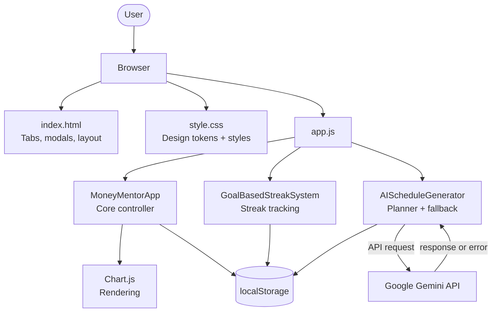
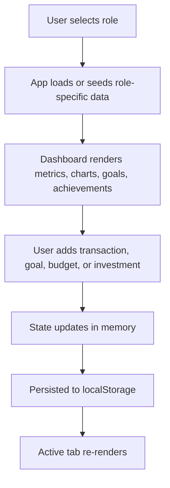

<p align="center">
  
</p>

<h1 align="center">Money Mentor V1</h1>

<p align="center">
  An AI-assisted personal finance dashboard built with vanilla JavaScript.
</p>

<p align="center">
  
  
  
  
  
</p>

<p align="center">
  
  
  
  
  
</p>

---

## Table of Contents

- [Project Status](#-project-status)
- [Overview](#-project-overview)
- [Problem Statement](#-problem-statement)
- [Why This Project Exists](#-why-this-project-exists)
- [Why Vanilla JavaScript](#-why-vanilla-javascript)
- [Project Goals](#-project-goals)
- [Key Features](#-key-features)
- [AI Features](#-ai-features)
- [Live Demo](#-live-demo)
- [Screenshots](#-screenshots)
- [Tech Stack](#-tech-stack)
- [Design Principles](#-design-principles)
- [Architecture Decisions](#-architecture-decisions)
- [Project Architecture](#-project-architecture)
- [Folder Structure](#-folder-structure)
- [Installation](#-installation)
- [AI Configuration](#-ai-configuration)
- [Running the Project](#-running-the-project)
- [Usage Guide](#-usage-guide)
- [Core Modules](#-core-modules)
- [Application Workflow](#-application-workflow)
- [Data Storage](#-data-storage)
- [Security Considerations](#-security-considerations)
- [Performance Optimizations](#-performance-optimizations)
- [Future Roadmap](#-future-roadmap)
- [Known Limitations](#-known-limitations)
- [Learning Outcomes](#-learning-outcomes)
- [Changelog](#-changelog)
- [Contributing](#-contributing)
- [License](#-license)
- [Disclaimer](#-disclaimer)
- [Acknowledgements](#-acknowledgements)
- [Author](#-author)
- [Support](#-support)

---

## 🚧 Project Status

Money Mentor V1.

**Current focus:**
- Improving AI features
- Strengthening security around API key handling
- Enhancing reports
- Preparing the backend architecture for a future release

**Version:** 1.0.0

## 📖 Project Overview

Money Mentor is a client-side personal finance tracker built with vanilla
HTML, CSS, and JavaScript. It lets users log transactions, track budgets,
monitor subscriptions and investments, and set savings goals — all rendered
through a single-page dashboard with Chart.js visualizations. The app ships
with two pre-configured user profiles (**Student** and **Professional**),
each with its own sample dataset and independent `localStorage` namespace.

## ❓ Problem Statement

Most personal finance tools are either too complex for casual users or too
generic to reflect different income/spending patterns — a student's finances
look nothing like a working professional's. Money Mentor addresses this by
offering role-specific dashboards with tailored sample data, budget
categories, and goal structures out of the box.

## 🎯 Why This Project Exists

The goal was to build a lightweight, dependency-minimal finance tracker that
works entirely in the browser without requiring a backend, database, or user
authentication — while still including meaningful features like goal
tracking, streaks, and AI-assisted planning.

## 💡 Why Vanilla JavaScript?

Money Mentor V1 intentionally avoids frontend frameworks. This was a
deliberate architectural choice, not a limitation:

- Understand browser APIs deeply (DOM, `localStorage`, `fetch`)
- Minimize external dependencies
- Keep startup time fast — no bundling or hydration overhead
- Demonstrate core JavaScript proficiency without framework abstractions
- Simplify deployment to a static host

## 🧭 Project Goals

- ✔ Learn modern JavaScript (ES6 classes, async/await, fetch)
- ✔ Build a single-page application without a framework
- ✔ Practice designing a financial dashboard UI
- ✔ Integrate a generative AI API into a real workflow
- ✔ Produce a portfolio-quality project demonstrating full-stack thinking

## ✨ Key Features

**📊 Finance**
- Transaction logging with type, category, description, and date filters
- Budget tracking per category with progress bars and remaining balance
- Subscription tracker with renewal countdown
- Investment portfolio tracker (gain/loss, return %, current vs. buy price)
- Reports tab with daily/weekly/monthly period toggle
- Transaction export to CSV

**🤖 AI**
- AI Financial Planner powered by the Gemini API
- Automatic goal allocation based on income, expenses, and risk tolerance
- Local fallback plan generator when the API is unavailable

**🎯 Productivity**
- Savings goals with progress bars and deadlines
- Goal-completion streak system (daily/longest streak tracking)
- Achievement badges (seeded, unlock-state stored per role)

**🎨 Interface**
- Role-based dashboards (Student / Professional) with independent data
- Light/dark theme toggle using CSS custom properties
- Dashboard metrics: balance, income, expenses, savings rate
- Expense breakdown (doughnut chart) and spending trend (line chart)

## 🤖 AI Features

- **AI Financial Planner** — a modal that collects monthly income, expenses,
  goals, risk tolerance, and age, then sends this data to the Google Gemini
  API (`gemini-1.5-flash-latest`) to generate a savings allocation plan.
- **Fallback plan generator** — if the Gemini API call fails, the app computes
  a static 30/50/20 (emergency fund / goals / investment) allocation locally.
- **AI Assistant tab** — chat interface with an initial greeting message.
  Full conversational logic is planned for a future release.

## 🌐 Live Demo

**[moneymentorsn.netlify.app](https://moneymentorsn.netlify.app/)**

> The live demo showcases the current client-side implementation. A future
> release will move AI requests behind a backend service to improve security.

## 📸 Screenshots

Screenshots will be added in the next release.

## 🛠️ Tech Stack

| Layer | Technology |
|-------|-----------|
| Markup | HTML5 |
| Styling | CSS3 with custom properties (design tokens for spacing, radius, shadows, color themes) |
| Logic | Vanilla JavaScript (ES6 classes) |
| Charts | [Chart.js](https://www.chartjs.org/) (doughnut & line charts) |
| Icons | Font Awesome 6 (CDN) |
| Fonts | Google Fonts — Inter |
| AI | Google Gemini API (`generativelanguage.googleapis.com`) |
| Storage | Browser `localStorage` (no database) |
| Backend | Client-side SPA — no server component |
| Hosting | Netlify |

## 🧱 Design Principles

- Vanilla JavaScript only — no frameworks
- No build tools or bundlers required
- Lightweight footprint, minimal dependencies
- Core budgeting and finance features continue to work locally after the
  application has loaded. AI-powered features require an internet connection.
- Responsive layout across screen sizes
- Client-side state management using plain JS classes

## 🏛️ Architecture Decisions

- Single-page application to keep deployment simple.
- Vanilla JavaScript to focus on core web APIs and avoid framework dependencies.
- Client-side persistence with `localStorage` for a backend-free experience.
- Modular ES6 class design for maintainability.
- AI functionality isolated within a dedicated planner component.

## 🏗️ Project Architecture

Money Mentor is a single-page application with no build step or server
component. All rendering, state, and persistence happen in the browser.



Data flows one way: user action → DOM event handler → state mutation in
`MoneyMentorApp.data` → persistence to `localStorage` → re-render of the
active tab.

## 📁 Folder Structure

```text
money-mentor-v1/
├── index.html
├── style.css
├── app.js
├── docs/
│   ├── banner.png
│   ├── demo.gif
│   └── screenshots/
├── LICENSE
└── README.md
```

The project currently follows a flat structure to keep the codebase simple.
Additional directories may be introduced as the application evolves.

## ⚙️ Installation

Money Mentor has no build dependencies — it runs directly from static files.

```bash
# Clone the repository
git clone https://github.com/ShadyNights/money-mentor-v1.git
cd money-mentor-v1
```

Optional (recommended for local development, to avoid CORS issues with
fetch calls to the Gemini API):

```bash
# Using Node's http-server
npx http-server . -p 5500

# OR using Python
python -m http.server 5500
```

## 🔐 AI Configuration

The current version communicates directly with the Google Gemini API from
the browser.

To use AI features, configure your own Gemini API key in the application
before running it.

> **Security Note**
> Exposing API keys in client-side applications is not recommended for
> production deployments. A future version will route AI requests through a
> backend service where secrets can be managed securely.

## ▶️ Running the Project

```bash
# Open directly in a browser
open index.html

# OR serve locally
npx http-server . -p 5500
# then visit http://localhost:5500
```

No install step, package manager, or environment setup is required beyond a
modern browser with JavaScript enabled.

## 📘 Usage Guide

1. **Choose a role** — toggle between Student and Professional at the top of
   the header; each role loads its own seeded dataset.
2. **Dashboard** — view balance, income, expenses, savings rate, and charts.
3. **Transactions** — add income/expense entries, filter by type/category/date,
   export to CSV.
4. **Budget** — create category budgets and track spend against limits.
5. **Subscriptions** — log recurring costs and see renewal countdowns.
6. **Investments** — add holdings and view computed gain/loss.
7. **Reports** — switch between daily/weekly/monthly views.
8. **AI Planner** — open the planner modal, enter income, expenses, goals,
   risk tolerance, and age to generate a plan.

## 🧩 Core Modules

<details>
<summary><code>MoneyMentorApp</code> — application controller</summary>

Handles state (transactions, budgets, goals, subscriptions, investments,
achievements), tab navigation, chart rendering, theme switching, and all
CRUD operations backed by `localStorage`.

</details>

<details>
<summary><code>GoalBasedStreakSystem</code> — streak tracking</summary>

Checks whether daily savings meet the pro-rated target for active goals,
increments or resets a streak counter, and persists results per user role.

</details>

<details>
<summary><code>AIScheduleGenerator</code> — AI planner</summary>

Builds the planner modal, sends user financial inputs to the Gemini API,
parses free-text goals into structured objects, and falls back to a static
allocation strategy if the API call fails.

</details>

## 🔄 Application Workflow



## 💾 Data Storage

All data is persisted in the browser via `localStorage`, namespaced by role:

- `moneymentor-data-{role}` — transactions, budgets, goals, subscriptions,
  investments, achievements
- `moneymentor-streaks-{role}` — streak counters
- `moneymentor-role` and `moneymentor-theme` — user preferences

There is no server-side database. Clearing browser storage removes all
saved data.

## 🔒 Security Considerations

Being transparent about the current state:

- AI requests are sent directly from the browser to the Gemini API, which
  means any API key configured in the client is visible to anyone
  inspecting the page source. A backend proxy is planned for a future
  release to manage this securely.
- There is no authentication or authorization — anyone with browser access
  to the device can view or edit all financial data.
- All data lives in `localStorage`, which is unencrypted and scoped to the
  browser/device — it is not synced or backed up.
- Input sanitization for dynamically injected HTML (e.g., transaction
  descriptions rendered via `innerHTML`) has not yet been audited.

## ⚡ Performance Optimizations

- Chart.js instances are explicitly destroyed before re-render to prevent
  memory leaks and duplicate canvases.
- CSS custom properties (design tokens) centralize theming, avoiding
  duplicated style rules across light/dark modes.
- No external JS framework — reduces bundle size and load time, since the
  entire app runs as static files with a single Chart.js dependency.

## 🗺️ Future Roadmap

- Route Gemini API requests through a secured backend proxy
- Add persistent backend storage (currently `localStorage` only)
- Add user authentication
- Add automated test coverage
- Expand AI Assistant into a full conversational interface
- Record and publish demo GIF and screenshots

## ⚠️ Known Limitations

- No backend — all data is local to the browser and device
- No authentication — single-device, single-session usage model
- AI requests are made directly from the client (see Security Considerations)
- Achievement unlocks currently rely on seeded static data rather than
  dynamic evaluation
- AI Assistant chat logic beyond the initial greeting is planned for a
  future release

## 🎓 Learning Outcomes

Building Money Mentor helped reinforce:

- Single-page application architecture without a framework
- `localStorage` as a persistence layer
- State management using plain JavaScript classes
- Data visualization with Chart.js
- Building a light/dark theme system with CSS custom properties
- Integrating a generative AI API into a real user workflow
- Structuring modular, maintainable vanilla JavaScript

## 📜 Changelog

### v1.0.0
- Initial public release
- Role-based dashboards (Student / Professional)
- AI Financial Planner with Gemini API integration
- Goal-based streak system
- Budget, subscription, and investment tracking
- Light/dark theme support

## 🤝 Contributing

Contributions are welcome. Suggested workflow:

```bash
# Fork the repo, then:
git checkout -b feature/your-feature-name
git commit -m "Add: description of change"
git push origin feature/your-feature-name
```

Open a pull request describing the change and its motivation. Please avoid
introducing build tooling or frameworks without discussion, since the
project intentionally stays dependency-light.

## 📄 License

This project is licensed under the MIT License. See the [LICENSE](LICENSE)
file for details.

## ⚠️ Disclaimer

Money Mentor V1 is an educational and portfolio project. It is intended for
personal finance tracking and experimentation only and should not be
considered financial, investment, or tax advice.

## 🙏 Acknowledgements

- [Chart.js](https://www.chartjs.org/) — dashboard and report charts
- [Font Awesome](https://fontawesome.com/) — UI icons
- [Google Fonts](https://fonts.google.com/) — Inter typeface
- [Google Gemini API](https://ai.google.dev/) — AI planner and assistant

## 👤 Author

**Kashif Ansari**
Full-stack developer based in Nagpur, Maharashtra, India.

GitHub: [github.com/ShadyNights](https://github.com/ShadyNights)

## 💬 Support

For bugs or feature requests, please open an issue on the repository:

[github.com/ShadyNights/money-mentor-v1/issues](https://github.com/ShadyNights/money-mentor-v1/issues)

---

<p align="center">
Built with ❤️ using HTML, CSS, JavaScript, Chart.js, and Google Gemini.
</p>

<p align="center">
If you find this project useful, consider giving it a ⭐ on GitHub.
</p>
